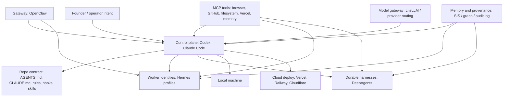

# Agentic Architecture Field Guide

[](https://github.com/frankxai/agentic-architecture-field-guide/actions/workflows/validate.yml)
[](LICENSE)
[](docs/runtime-decision-matrix.md)
[](scripts/agent-os-audit.ps1)

The field guide for designing practical agent operating systems: local-first when privacy and control matter, cloud-ready when teams need durable services, dashboards, and deployment paths.

It is intentionally vendor-neutral. Hermes Agent, OpenClaw, DeepAgents, Claude Code, Codex, MCP, LiteLLM, Vercel, Railway, Cloudflare, and Starlight-style swarms are treated as composable layers, not competing religions.

## Who This Is For

| Reader | Use this repo to |
| --- | --- |
| Solo founder | Turn one machine into a controlled agent fleet without losing provenance |
| AI engineer | Decide when to use coding agents, harnesses, MCP, gateways, and memory |
| CTO / platform lead | Set trust boundaries, deployment patterns, and review policies |
| Tool builder | Position a new agent runtime without confusing users or overstating ownership |
| Educator / curator | Explain the agent OS stack with primary sources and diagrams |

## Start Here

```powershell
git clone https://github.com/frankxai/agentic-architecture-field-guide.git
cd agentic-architecture-field-guide
powershell -ExecutionPolicy Bypass -File scripts/validate-docs.ps1
powershell -ExecutionPolicy Bypass -File scripts/agent-os-audit.ps1
```

Then read:

1. [Runtime decision matrix](docs/runtime-decision-matrix.md)
2. [Reference architectures](docs/reference-architectures.md)
3. [Security and trust boundaries](docs/security-boundaries.md)
4. [Founder operating models](docs/founder-operating-models.md)
5. [Local install and audit](docs/local-install-audit.md)

## The Stack In One Diagram



## Decision Matrix

| Need | Use first | Add when |
| --- | --- | --- |
| Local multi-agent handoffs and durable task board | Hermes Agent | You want named workers, isolated profiles, and a local shared board |
| Chat-app gateway to local agents | OpenClaw | You want Slack, Telegram, WhatsApp, Discord, or mobile channels pointed at agents |
| Long-running structured research/coding harnesses | DeepAgents | You need durable execution, human-in-the-loop, or reusable sub-agent scaffolds |
| Repo-native coding control plane | Codex | You want edits, tests, reviews, worktrees, skills, hooks, GitHub, CLI, and app surfaces |
| Pair-coding and maintainer lanes | Claude Code | You want CLAUDE.md context, skills, MCP, subagents, and agent-team workflows |
| Multi-provider model routing | LiteLLM Agent Platform | You need provider failover, budgets, observability, or shared model policy |
| Productized operating model | Starlight Intelligence System | You need memory, provenance, profile topology, audits, and founder-ready playbooks |

## Opinionated Defaults

- Start with one control plane per repo. Use separate worktrees for parallel agents.
- Treat chat, web pages, issue comments, and model output as untrusted input.
- Keep memory as provenance and recall, not a secret store.
- Give every agent a role, scope, review boundary, and exit condition.
- Put shared behavior in `AGENTS.md`; put tool-specific deltas in the tool-specific file; put mandatory safety in hooks.
- Use Vercel for web surfaces and workflows, Railway or a VM for always-on gateways, Cloudflare for edge/static/Workers, and the local machine for private agent execution.

## Repository Map

| Path | Purpose |
| --- | --- |
| [docs/runtime-decision-matrix.md](docs/runtime-decision-matrix.md) | Pick the right runtime or combination |
| [docs/reference-architectures.md](docs/reference-architectures.md) | Battle-tested local, team, and cloud patterns |
| [docs/founder-operating-models.md](docs/founder-operating-models.md) | Founder/team workflows and delegation boundaries |
| [docs/security-boundaries.md](docs/security-boundaries.md) | Trust tiers, data boundaries, and permission model |
| [docs/local-install-audit.md](docs/local-install-audit.md) | Machine audit and install policy |
| [docs/adr-template.md](docs/adr-template.md) | Lightweight architecture decision record |
| [docs/glossary.md](docs/glossary.md) | Terms used across the guide |
| [docs/sources.md](docs/sources.md) | Primary source links |
| [scripts/agent-os-audit.ps1](scripts/agent-os-audit.ps1) | Local read-only audit script |

## Related Repositories

- [awesome-agent-operating-systems](https://github.com/frankxai/awesome-agent-operating-systems) - curated ecosystem index.
- [starlight-agent-army-architecture](https://github.com/frankxai/starlight-agent-army-architecture) - Starlight implementation playbook.
- [awesome-hermes-agents](https://github.com/frankxai/awesome-hermes-agents) - Hermes-specific resources.
- [starlight-swarm](https://github.com/frankxai/starlight-swarm) - swarm dashboard and audit surface.
- [hermes-cockpit](https://github.com/frankxai/hermes-cockpit) - Hermes local operator cockpit.

## Provenance

Hermes Agent is by Nous Research, OpenClaw is by the OpenClaw project, DeepAgents is by LangChain, Claude Code is by Anthropic, and Codex is by OpenAI. This repository is an independent architecture guide that links to upstream sources and keeps Starlight-specific opinions clearly labeled.
