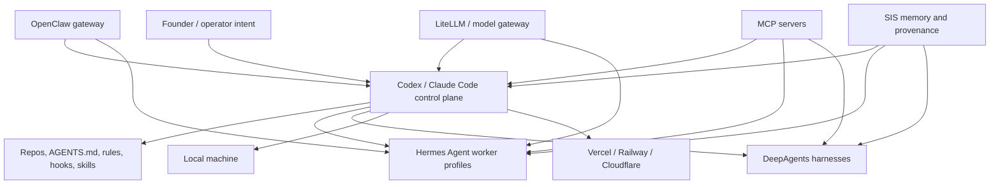

# Agentic Architecture Field Guide

[](https://github.com/frankxai/agentic-architecture-field-guide/actions/workflows/validate.yml)
[](LICENSE)

Vendor-neutral field guide for designing local-first and cloud-ready agent operating systems. It explains when to use Hermes Agent, OpenClaw, DeepAgents, Claude Code, Codex, MCP, LiteLLM Agent Platform, and Starlight-style swarms without implying ownership of any upstream project.

## Quickstart

```powershell
git clone https://github.com/frankxai/agentic-architecture-field-guide.git
cd agentic-architecture-field-guide
powershell -ExecutionPolicy Bypass -File scripts/validate-docs.ps1
powershell -ExecutionPolicy Bypass -File scripts/agent-os-audit.ps1 -Json
```

## Mental Model



## Decision Matrix

| Need | Use first | Add when |
| --- | --- | --- |
| Local multi-agent handoffs and durable task board | Hermes Agent | You want isolated named worker profiles and a local shared board |
| Chat-app gateway to local agents | OpenClaw | You want Slack, Telegram, WhatsApp, Discord, or mobile surfaces pointed at agents |
| Long-running structured research/coding harnesses | DeepAgents | You need durable execution, human-in-the-loop, or reusable sub-agent scaffolds |
| Repo-native coding agent with rules and MCP | Codex | You want edits, tests, reviews, worktrees, skills, hooks, and GitHub/CLI/app surfaces |
| Pair-coding and team coding assistant | Claude Code | You want CLAUDE.md context, subagents, skills, MCP, and agent-team workflows |
| Multi-provider model routing | LiteLLM Agent Platform | You need provider failover, budgets, observability, or shared model policy |
| Productized operating model | Starlight Intelligence System | You need memory, provenance, profile topology, audits, and founder-ready playbooks |

## Local vs Cloud

| Runtime | Best for | Deployment shape |
| --- | --- | --- |
| Local workstation | Private repos, fast iteration, personal agents | Hermes, Codex CLI/app, Claude Code, OpenClaw gateway, local MCP |
| Vercel | Web dashboards, APIs, workflows, frontends | Next.js apps, Vercel Functions, Cron, Workflow, AI SDK |
| Railway | Always-on services and simple containers | OpenClaw gateway, model proxies, worker APIs |
| Cloudflare | Edge routing, static docs, Workers, Durable Objects | Public docs, lightweight agent APIs, queue-like coordination |

## Guides

- [Runtime decision matrix](docs/runtime-decision-matrix.md)
- [Local install and audit](docs/local-install-audit.md)
- [Security and trust boundaries](docs/security-boundaries.md)
- [Sources and provenance](docs/sources.md)

## Related Repositories

- [awesome-agent-operating-systems](https://github.com/frankxai/awesome-agent-operating-systems) - curated ecosystem index.
- [starlight-agent-army-architecture](https://github.com/frankxai/starlight-agent-army-architecture) - Starlight implementation playbook.
- [awesome-hermes-agents](https://github.com/frankxai/awesome-hermes-agents) - Hermes-specific resources and operator patterns.
- [starlight-swarm](https://github.com/frankxai/starlight-swarm) - swarm dashboard and audit surface.
- [hermes-cockpit](https://github.com/frankxai/hermes-cockpit) - Hermes local operator cockpit.

## Provenance

Hermes Agent is by Nous Research, OpenClaw is by the OpenClaw project, DeepAgents is by LangChain, Claude Code is by Anthropic, and Codex is by OpenAI. This repository is an independent architecture guide that links to upstream sources and keeps Starlight-specific opinions clearly labeled.
