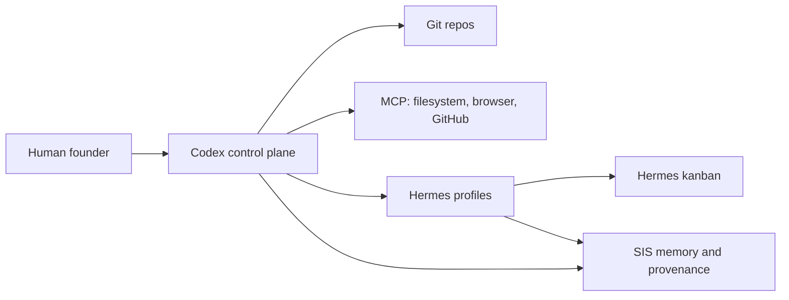
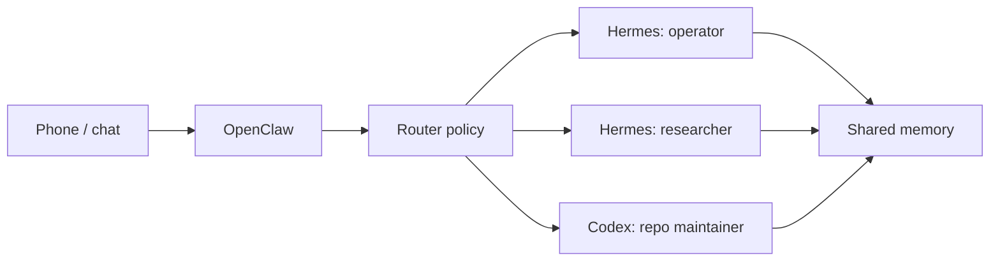
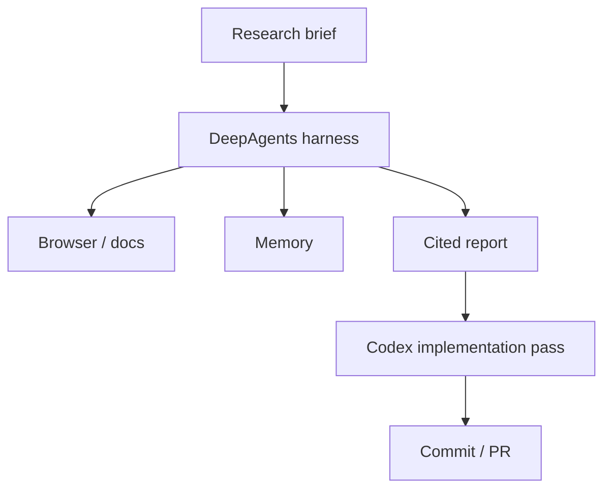
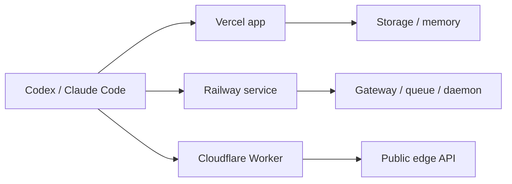

# Reference Architectures

These are starting points, not doctrine. Pick the smallest architecture that gives you control, auditability, and momentum.

## Pattern 1: Solo Founder Workstation

Use when one operator wants many durable lanes without giving up local control.

Default stack:

- Codex for repo edits, tests, reviews, commits, and docs.
- Hermes Agent for ongoing named worker profiles and handoff cards.
- MCP for filesystem, browser, GitHub, and memory.
- SIS or another provenance layer for decisions, health, and recall.

Avoid:

- Running multiple agents in one dirty worktree.
- Letting chat gateways write to repos directly.

## Pattern 2: Chat-Operated Local Fleet

Use when agents should be reachable from chat apps, but only through an allowlisted gateway.

Default stack:

- OpenClaw as the channel gateway.
- Hermes profiles for local task lanes.
- Codex for repo-changing work.
- Explicit owner allowlists and approval rules.

Avoid:

- Giving broad write access to channel-originated requests.
- Running OpenClaw without a clear owner, auth mode, and channel policy.

## Pattern 3: Research Factory

Use when the hard part is synthesis before implementation.

Default stack:

- DeepAgents for long-horizon research plans and sub-agent structure.
- Browser automation for source verification.
- Codex for converting the result into code, docs, or repo changes.
- ADRs for irreversible decisions.

Avoid:

- Letting research agents deploy or merge.
- Treating generated synthesis as a source unless it links back to primary material.

## Pattern 4: Cloud Product Surface

Use when the agent system needs a public dashboard, API, or always-on service.

Default stack:

- Vercel for dashboards, docs, APIs, previews, and workflows.
- Railway for always-on services and containers.
- Cloudflare for edge routing, static sites, and Workers.
- GitHub Actions for validation.

Avoid:

- Deploying long-running gateways to serverless-only functions.
- Mixing public user input with privileged local tools.
