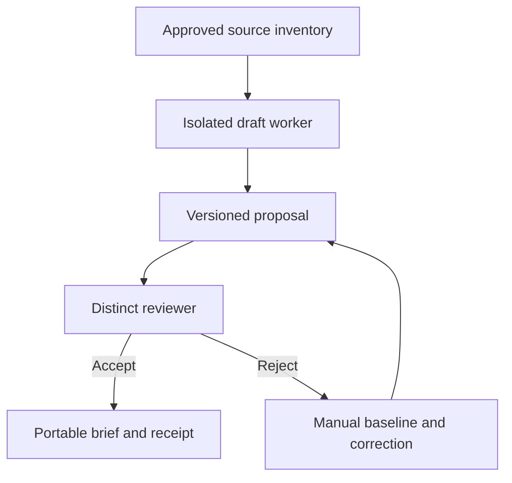

# Worked example: a source-grounded client brief

This is a synthetic architecture planning example for an AI consultant with a
small delivery team. There is no client deployment, measured outcome or vendor
endorsement behind it. The local report tool is runnable; the drafting worker
and runtime controls in this decision are specified for a future bounded trial.

## The decision

Prepare a source-linked brief that a different implementation reviewer can
accept or reject. Begin with one isolated drafting worker and preserve manual
drafting as the baseline. A hosted team workflow remains an alternative until
shared access and durable coordination earn its additional operating cost.

The initial trial uses owner-selected public or synthetic sources. No client
records, private memory, publishing, billing, email or deployment access is part
of it. The operator configures the real runtime permissions separately.



Sources crossing into the drafting worker are data, including any instructions
they contain. The worker's allowed writes end at its local trial directory.
External actions require a separate authorization decision. The diagram describes
the intended boundary; it is not evidence that a provider enforces it.

## Produce the editable evidence packet

Read the [input](decision.json) and the [kit instructions](../../docs/architecture-proof-kit.md).
From the repository root:

```sh
node scripts/architecture-review.mjs examples/consultant-brief/decision.json
```

The packet includes the selected option and two alternatives, four trust
boundaries, six planned runtime failure tests, an export/recovery route, stop
rule and hypothetical cost comparison. Its input and tool fingerprints bind the
report to the local versions used. The JSON remains the editable source.

## Hypothetical cost model

These values demonstrate arithmetic and are not current vendor rates:

| Assumption | Value |
| --- | --- |
| Monthly attempts, including retries | 100 |
| Expected acceptance | 75% |
| Input / output tokens per attempt | 12,000 / 2,000 |
| Input / output cost per million | 2 / 8 EUR |
| Fixed monthly cash | 20 EUR |
| Human minutes per attempt | 6 |
| Assumed hourly time value | 60 EUR |
| Assumed monthly cash limit | 50 EUR |

The model gives 24 EUR monthly cash and 624 EUR including 600 human minutes.
At an assumed 75 accepted results, that is 0.32 EUR cash and 8.32 EUR including
valued time per expected accepted result. This exposes the human review cost
that a token-only comparison would miss. With no observations, actual usefulness,
time saved and cost per accepted result remain unknown.

## Deployment and recovery trial

1. Create a fresh isolated directory and source inventory. Record the source
   versions and the operator-approved runtime configuration and spend cap.
2. Complete and time a manual brief under the same acceptance rubric.
3. Configure one drafting worker with only approved source reads and local
   proposal writes. Do not grant external-action tools for this trial.
4. Run the six adversarial and recovery fixtures defined in the JSON. Retain
   failures, retries, usage and human intervention before a nominal attempt.
5. Have a different reviewer check source links, unsupported claims, usefulness
   and the exact artifact version. Record the verdict rather than a score alone.
6. Reopen the JSON, Markdown and evidence packet outside the drafting session.
   Compare all trial costs with the manual baseline.

If a boundary fails, stop the worker, remove its tool grants and resume manual
drafting. Preserve rejected proposals and their costs. Do not recover by copying
private material into a public issue. The report tool can be removed without
migrating a database or losing the editable JSON and Markdown.

## Acceptance and contribution

The accepted result is one usable source-linked brief, a reopened portable packet
and an inspected runtime test receipt. An illustrative plan or passing report
unit tests cannot establish that result. Report it only after an independent
review of a real, approved trial.

Contribute a synthetic failure case and a corrected method that another
practitioner can reproduce. Keep private customer evidence under its owner's
control. The public example remains MIT; any professional edition needs its own
completed implementation assets, reviewed terms, support and release proof.
